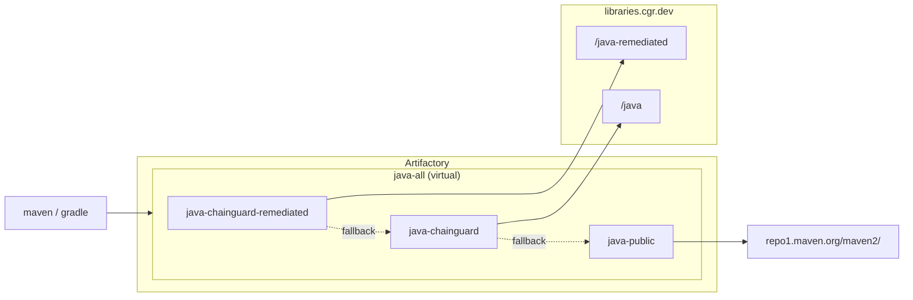

# Chainguard Libraries for Java — Artifactory

Provisions an Artifactory virtual Maven repository backed by the Chainguard
remediated index, the Chainguard standard index, and public Maven Central as
fallback (in that order), following the JFrog Artifactory setup recommended in
the
[Chainguard Libraries for Java global configuration docs](https://edu.chainguard.dev/chainguard/libraries/java/global-configuration/#jfrog-artifactory).

## Architecture



## Usage

1. Generate a Chainguard pull token (replace `<org>` with your organization):

   ```sh
   eval $(chainctl auth pull-token --output env --repository=java --parent=<org>)
   ```

   This exports `CHAINGUARD_JAVA_IDENTITY_ID` and `CHAINGUARD_JAVA_TOKEN`.

2. Point the Artifactory provider at your instance:

   ```sh
   export JFROG_URL=https://example.jfrog.io
   export JFROG_ACCESS_TOKEN=<artifactory-admin-token>
   ```

   Generate an admin token in the JFrog UI under Administration → User
   Management → Access Tokens → Generate Admin Token
   ([JFrog docs](https://docs.jfrog.com/administration/docs/access-tokens)).

3. Write `terraform.tfvars`:

   ```sh
   cat > terraform.tfvars <<***REMOVED***
   name                = "your-name"
   chainguard_username = "${CHAINGUARD_JAVA_IDENTITY_ID}"
   chainguard_password = "${CHAINGUARD_JAVA_TOKEN}"
   ***REMOVED***
   ```

4. `terraform init && terraform apply`.

Point Maven/Gradle at `https://<artifactory-host>/artifactory/your-name-java-all/`.

## Example

### curl

Smoke-test the virtual (substitute your Artifactory user and access token):

```sh
curl -u "$JFROG_USER:$JFROG_ACCESS_TOKEN" -LO "$JFROG_URL/artifactory/your-name-java-all/com/google/guava/guava/33.4.0-jre/guava-33.4.0-jre.jar"
```

### Maven

Add to `~/.m2/settings.xml`:

```xml
<servers><server><id>cgr</id><username>YOUR_JFROG_USER</username><password>YOUR_JFROG_ACCESS_TOKEN</password></server></servers>
<mirrors><mirror><id>cgr</id><mirrorOf>*</mirrorOf><url>https://<artifactory-host>/artifactory/your-name-java-all/</url></mirror></mirrors>
```

```sh
mvn dependency:get -Dartifact=com.google.guava:guava:33.4.0-jre
```

### Gradle

In `build.gradle.kts`:

```kotlin
repositories {
    maven {
        url = uri("https://<artifactory-host>/artifactory/your-name-java-all/")
        credentials { username = System.getenv("JFROG_USER"); password = System.getenv("JFROG_ACCESS_TOKEN") }
    }
}
```

```sh
./gradlew dependencies --configuration runtimeClasspath
```
