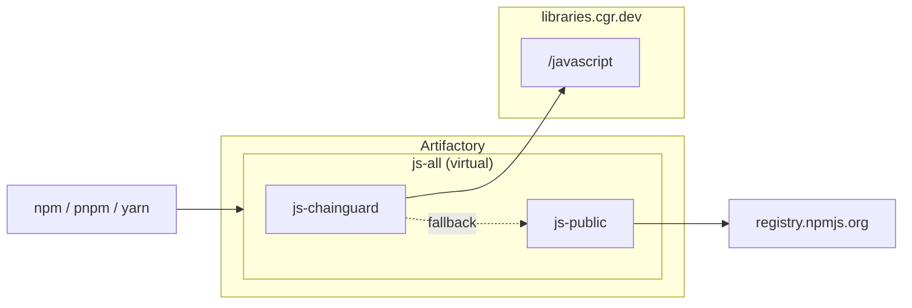

# Chainguard Libraries for JavaScript with public npm fallback — Artifactory

> [!WARNING]
> Prefer the [`artifactory-javascript`](../artifactory-javascript/) module
> over this one. The Chainguard Repository for JavaScript has built-in
> upstream fallback that enforces malware scanning and a publish cooldown on
> newly-released packages; the `artifactory-javascript` module points
> Artifactory at that endpoint and lets Chainguard handle the fallback. This
> module instead has Artifactory itself fall back to public npm, which
> bypasses those protections. Use it only when Chainguard's upstream fallback
> is disabled by policy.

Provisions an Artifactory virtual npm repository backed by a Chainguard remote
and a public npm remote (in that order), following the JFrog Artifactory setup
recommended in the
[Chainguard Libraries for JavaScript global configuration docs](https://edu.chainguard.dev/chainguard/libraries/javascript/global-configuration/#jfrog-artifactory),
extended with a public npm fallback.

## Architecture



## Usage

1. Generate a Chainguard pull token (replace `<org>` with your organization):

   ```sh
   eval $(chainctl auth pull-token --output env --repository=javascript --parent=<org>)
   ```

   This exports `CHAINGUARD_JAVASCRIPT_IDENTITY_ID` and `CHAINGUARD_JAVASCRIPT_TOKEN`.

2. Point the Artifactory provider at your instance:

   ```sh
   export JFROG_URL=https://example.jfrog.io
   export JFROG_ACCESS_TOKEN=<artifactory-admin-token>
   ```

   Generate an admin token in the JFrog UI under Administration → User
   Management → Access Tokens → Generate Admin Token
   ([JFrog docs](https://docs.jfrog.com/administration/docs/access-tokens)).

3. Write `terraform.tfvars`:

   ```sh
   cat > terraform.tfvars <<***REMOVED***
   name                = "your-name"
   chainguard_username = "${CHAINGUARD_JAVASCRIPT_IDENTITY_ID}"
   chainguard_password = "${CHAINGUARD_JAVASCRIPT_TOKEN}"
   ***REMOVED***
   ```

4. `terraform init && terraform apply`.

Point your package manager at `https://<artifactory-host>/artifactory/api/npm/your-name-js-all/`.

## Example

### curl

Smoke-test the virtual:

```sh
curl -u "$JFROG_USER:$JFROG_ACCESS_TOKEN" -L "$JFROG_URL/artifactory/api/npm/your-name-js-all/lodash" | head -5
```

### npm

```sh
npm config set registry "https://<artifactory-host>/artifactory/api/npm/your-name-js-all/" && npm config set "//<artifactory-host>/artifactory/api/npm/your-name-js-all/:_authToken" "$JFROG_ACCESS_TOKEN"
npm install lodash
```

### pnpm

```sh
pnpm config set registry "https://<artifactory-host>/artifactory/api/npm/your-name-js-all/" && pnpm config set "//<artifactory-host>/artifactory/api/npm/your-name-js-all/:_authToken" "$JFROG_ACCESS_TOKEN"
pnpm add lodash
```

### Yarn Berry (v2+)

In `.yarnrc.yml`:

```yaml
npmRegistryServer: "https://<artifactory-host>/artifactory/api/npm/your-name-js-all/"
npmRegistries:
  "//<artifactory-host>/artifactory/api/npm/your-name-js-all":
    npmAuthToken: "${JFROG_ACCESS_TOKEN}"
```

```sh
yarn add lodash
```
