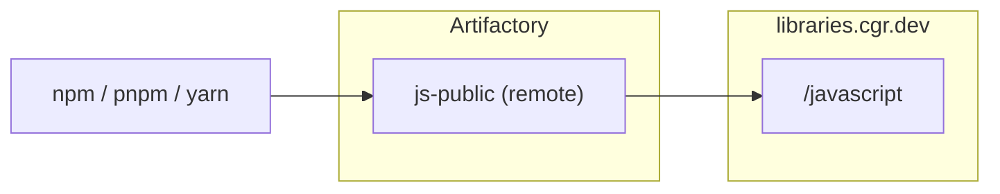

# Chainguard Libraries for JavaScript — Artifactory (single remote)

Provisions a single Artifactory npm remote repository pointed at the
Chainguard JavaScript index (or any upstream npm registry you specify),
following the JFrog Artifactory setup recommended in the
[Chainguard Libraries for JavaScript global configuration docs](https://edu.chainguard.dev/chainguard/libraries/javascript/global-configuration/#jfrog-artifactory).
This is the recommended setup when you rely on Chainguard's own upstream
fallback rather than fronting Chainguard with a virtual repo.

## Architecture



## Usage

1. Generate a Chainguard pull token (replace `<org>` with your organization):

   ```sh
   eval $(chainctl auth pull-token --output env --repository=javascript --parent=<org>)
   ```

   This exports `CHAINGUARD_JAVASCRIPT_IDENTITY_ID` and `CHAINGUARD_JAVASCRIPT_TOKEN`.

2. Point the Artifactory provider at your instance:

   ```sh
   export JFROG_URL=https://example.jfrog.io
   export JFROG_ACCESS_TOKEN=<artifactory-admin-token>
   ```

   Generate an admin token in the JFrog UI under Administration → User
   Management → Access Tokens → Generate Admin Token
   ([JFrog docs](https://docs.jfrog.com/administration/docs/access-tokens)).

3. Write `terraform.tfvars`:

   ```sh
   cat > terraform.tfvars <<EOF
   name     = "your-name"
   username = "${CHAINGUARD_JAVASCRIPT_IDENTITY_ID}"
   password = "${CHAINGUARD_JAVASCRIPT_TOKEN}"
   EOF
   ```

4. `terraform init && terraform apply`.

Point your package manager at `https://<artifactory-host>/artifactory/api/npm/your-name-js-public/`.

## Example

### curl

Smoke-test the remote:

```sh
curl -u "$JFROG_USER:$JFROG_ACCESS_TOKEN" -L "$JFROG_URL/artifactory/api/npm/your-name-js-public/lodash" | head -5
```

### npm

```sh
npm config set registry "https://<artifactory-host>/artifactory/api/npm/your-name-js-public/" && npm config set "//<artifactory-host>/artifactory/api/npm/your-name-js-public/:_authToken" "$JFROG_ACCESS_TOKEN"
npm install lodash
```

### pnpm

```sh
pnpm config set registry "https://<artifactory-host>/artifactory/api/npm/your-name-js-public/" && pnpm config set "//<artifactory-host>/artifactory/api/npm/your-name-js-public/:_authToken" "$JFROG_ACCESS_TOKEN"
pnpm add lodash
```

### Yarn Berry (v2+)

In `.yarnrc.yml`:

```yaml
npmRegistryServer: "https://<artifactory-host>/artifactory/api/npm/your-name-js-public/"
npmRegistries:
  "//<artifactory-host>/artifactory/api/npm/your-name-js-public":
    npmAuthToken: "${JFROG_ACCESS_TOKEN}"
```

```sh
yarn add lodash
```
