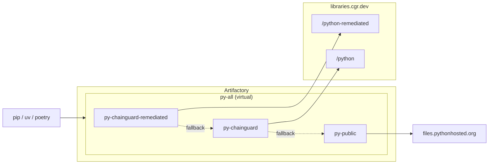

# Chainguard Libraries for Python — Artifactory

Provisions an Artifactory virtual PyPI repository backed by the Chainguard
remediated index, the Chainguard standard index, and public PyPI as fallback
(in that order), following the JFrog Artifactory setup recommended in the
[Chainguard Libraries for Python management docs](https://edu.chainguard.dev/chainguard/libraries/python/management/#jfrog-artifactory).

## Architecture



## Usage

1. Generate a Chainguard pull token (replace `<org>` with your organization):

   ```sh
   eval $(chainctl auth pull-token --output env --repository=python --parent=<org>)
   ```

   This exports `CHAINGUARD_PYTHON_IDENTITY_ID` and `CHAINGUARD_PYTHON_TOKEN`.

2. Point the Artifactory provider at your instance:

   ```sh
   export JFROG_URL=https://example.jfrog.io
   export JFROG_ACCESS_TOKEN=<artifactory-admin-token>
   ```

   Generate an admin token in the JFrog UI under Administration → User
   Management → Access Tokens → Generate Admin Token
   ([JFrog docs](https://docs.jfrog.com/administration/docs/access-tokens)).

3. Write `terraform.tfvars`:

   ```sh
   cat > terraform.tfvars <<EOF
   name                = "your-name"
   chainguard_username = "${CHAINGUARD_PYTHON_IDENTITY_ID}"
   chainguard_password = "${CHAINGUARD_PYTHON_TOKEN}"
   EOF
   ```

4. `terraform init && terraform apply`.

Point pip at `https://<artifactory-host>/artifactory/api/pypi/your-name-py-all/simple/`.

## Example

### curl

Smoke-test the virtual:

```sh
curl -u "$JFROG_USER:$JFROG_ACCESS_TOKEN" -L "$JFROG_URL/artifactory/api/pypi/your-name-py-all/simple/requests/" | head -5
```

### pip

```sh
pip install --index-url "https://$JFROG_USER:$JFROG_ACCESS_TOKEN@<artifactory-host>/artifactory/api/pypi/your-name-py-all/simple/" requests
```

### uv

```sh
uv pip install --index-url "https://$JFROG_USER:$JFROG_ACCESS_TOKEN@<artifactory-host>/artifactory/api/pypi/your-name-py-all/simple/" requests
```

### Poetry

```sh
poetry source add cgr "https://<artifactory-host>/artifactory/api/pypi/your-name-py-all/simple/"
poetry config http-basic.cgr "$JFROG_USER" "$JFROG_ACCESS_TOKEN"
poetry add requests
```
