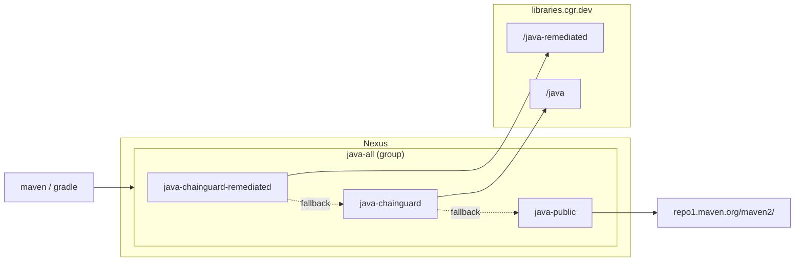

# Chainguard Libraries for Java — Sonatype Nexus

Provisions a Nexus group Maven repository backed by the Chainguard remediated
index, the Chainguard standard index, and public Maven Central as fallback (in
that order), following the Nexus setup recommended in the
[Chainguard Libraries for Java global configuration docs](https://edu.chainguard.dev/chainguard/libraries/java/global-configuration/#sonatype-nexus-repository).

## Architecture



## Usage

1. Generate a Chainguard pull token (replace `<org>` with your organization):

   ```sh
   eval $(chainctl auth pull-token --output env --repository=java --parent=<org>)
   ```

   This exports `CHAINGUARD_JAVA_IDENTITY_ID` and `CHAINGUARD_JAVA_TOKEN`.

2. Point the Nexus provider at your instance:

   ```sh
   export NEXUS_URL=https://nexus.example.com
   export NEXUS_USERNAME=<admin-user>
   export NEXUS_PASSWORD=<admin-password>
   ```

   The provider reads `NEXUS_URL`, `NEXUS_USERNAME`, and `NEXUS_PASSWORD`
   from the environment.

3. Write `terraform.tfvars`:

   ```sh
   cat > terraform.tfvars <<***REMOVED***
   name                = "your-name"
   chainguard_username = "${CHAINGUARD_JAVA_IDENTITY_ID}"
   chainguard_password = "${CHAINGUARD_JAVA_TOKEN}"
   ***REMOVED***
   ```

4. `terraform init && terraform apply`.

Point Maven/Gradle at `${NEXUS_URL}/repository/your-name-java-all/`.

## Example

### curl

Smoke-test the group:

```sh
curl -u "$NEXUS_USERNAME:$NEXUS_PASSWORD" -LO "$NEXUS_URL/repository/your-name-java-all/com/google/guava/guava/33.4.0-jre/guava-33.4.0-jre.jar"
```

### Maven

Add to `~/.m2/settings.xml`:

```xml
<servers><server><id>cgr</id><username>NEXUS_USER</username><password>NEXUS_PASS</password></server></servers>
<mirrors><mirror><id>cgr</id><mirrorOf>*</mirrorOf><url>http://<nexus-host>:8081/repository/your-name-java-all/</url></mirror></mirrors>
```

```sh
mvn dependency:get -Dartifact=com.google.guava:guava:33.4.0-jre
```

### Gradle

In `build.gradle.kts`:

```kotlin
repositories {
    maven {
        url = uri("http://<nexus-host>:8081/repository/your-name-java-all/")
        credentials { username = System.getenv("NEXUS_USERNAME"); password = System.getenv("NEXUS_PASSWORD") }
        isAllowInsecureProtocol = true
    }
}
```

```sh
./gradlew dependencies --configuration runtimeClasspath
```
