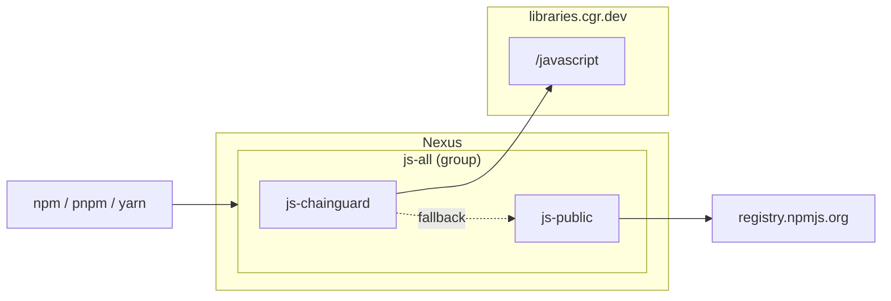

# Chainguard Libraries for JavaScript with public npm fallback — Sonatype Nexus

> [!WARNING]
> Prefer the [`nexus-javascript`](../nexus-javascript/) module over this one.
> The Chainguard Repository for JavaScript has built-in upstream fallback
> that enforces malware scanning and a publish cooldown on newly-released
> packages; the `nexus-javascript` module points Nexus at that endpoint and
> lets Chainguard handle the fallback. This module instead has Nexus itself
> fall back to public npm, which bypasses those protections. Use it only
> when Chainguard's upstream fallback is disabled by policy.

Provisions a Nexus group npm repository backed by a Chainguard proxy and a
public npm proxy (in that order), following the Nexus setup recommended in
the
[Chainguard Libraries for JavaScript global configuration docs](https://edu.chainguard.dev/chainguard/libraries/javascript/global-configuration/#sonatype-nexus-repository),
extended with a public npm fallback.

## Architecture



## Usage

1. Generate a Chainguard pull token (replace `<org>` with your organization):

   ```sh
   eval $(chainctl auth pull-token --output env --repository=javascript --parent=<org>)
   ```

   This exports `CHAINGUARD_JAVASCRIPT_IDENTITY_ID` and `CHAINGUARD_JAVASCRIPT_TOKEN`.

2. Point the Nexus provider at your instance:

   ```sh
   export NEXUS_URL=https://nexus.example.com
   export NEXUS_USERNAME=<admin-user>
   export NEXUS_PASSWORD=<admin-password>
   ```

   The provider reads `NEXUS_URL`, `NEXUS_USERNAME`, and `NEXUS_PASSWORD`
   from the environment.

3. Write `terraform.tfvars`:

   ```sh
   cat > terraform.tfvars <<EOF
   name                = "your-name"
   chainguard_username = "${CHAINGUARD_JAVASCRIPT_IDENTITY_ID}"
   chainguard_password = "${CHAINGUARD_JAVASCRIPT_TOKEN}"
   EOF
   ```

4. `terraform init && terraform apply`.

Point your package manager at `${NEXUS_URL}/repository/your-name-js-all/`.

## Example

### curl

Smoke-test the group:

```sh
curl -u "$NEXUS_USERNAME:$NEXUS_PASSWORD" -L "$NEXUS_URL/repository/your-name-js-all/lodash" | head -5
```

### npm

```sh
npm config set registry "http://<nexus-host>:8081/repository/your-name-js-all/" && npm config set "//<nexus-host>:8081/repository/your-name-js-all/:_auth" "$(printf '%s:%s' "$NEXUS_USERNAME" "$NEXUS_PASSWORD" | base64)"
npm install lodash
```

### pnpm

```sh
pnpm config set registry "http://<nexus-host>:8081/repository/your-name-js-all/" && pnpm config set "//<nexus-host>:8081/repository/your-name-js-all/:_auth" "$(printf '%s:%s' "$NEXUS_USERNAME" "$NEXUS_PASSWORD" | base64)"
pnpm add lodash
```

### Yarn Berry (v2+)

In `.yarnrc.yml`:

```yaml
npmRegistryServer: "http://<nexus-host>:8081/repository/your-name-js-all/"
npmRegistries:
  "//<nexus-host>:8081/repository/your-name-js-all":
    npmAlwaysAuth: true
    npmAuthIdent: "${NEXUS_USERNAME}:${NEXUS_PASSWORD}"
```

```sh
yarn add lodash
```
