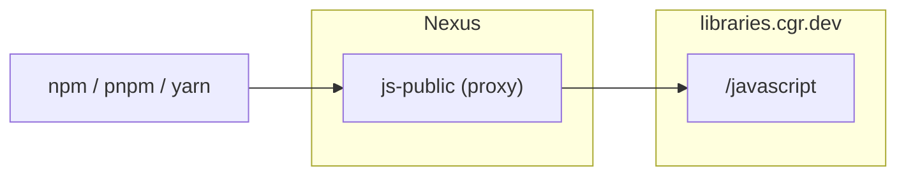

# Chainguard Libraries for JavaScript — Sonatype Nexus (single proxy)

Provisions a single Nexus npm proxy repository pointed at the Chainguard
JavaScript index (or any upstream npm registry you specify), following the
Nexus setup recommended in the
[Chainguard Libraries for JavaScript global configuration docs](https://edu.chainguard.dev/chainguard/libraries/javascript/global-configuration/#sonatype-nexus-repository).
This is the recommended setup when you rely on Chainguard's own upstream
fallback rather than fronting Chainguard with a group repo.

## Architecture



## Usage

1. Generate a Chainguard pull token (replace `<org>` with your organization):

   ```sh
   eval $(chainctl auth pull-token --output env --repository=javascript --parent=<org>)
   ```

   This exports `CHAINGUARD_JAVASCRIPT_IDENTITY_ID` and `CHAINGUARD_JAVASCRIPT_TOKEN`.

2. Point the Nexus provider at your instance:

   ```sh
   export NEXUS_URL=https://nexus.example.com
   export NEXUS_USERNAME=<admin-user>
   export NEXUS_PASSWORD=<admin-password>
   ```

   The provider reads `NEXUS_URL`, `NEXUS_USERNAME`, and `NEXUS_PASSWORD`
   from the environment.

3. Write `terraform.tfvars`:

   ```sh
   cat > terraform.tfvars <<EOF
   name     = "your-name"
   username = "${CHAINGUARD_JAVASCRIPT_IDENTITY_ID}"
   password = "${CHAINGUARD_JAVASCRIPT_TOKEN}"
   EOF
   ```

4. `terraform init && terraform apply`.

Point your package manager at `${NEXUS_URL}/repository/your-name-js-public/`.

## Example

### curl

Smoke-test the proxy:

```sh
curl -u "$NEXUS_USERNAME:$NEXUS_PASSWORD" -L "$NEXUS_URL/repository/your-name-js-public/lodash" | head -5
```

### npm

```sh
npm config set registry "http://<nexus-host>:8081/repository/your-name-js-public/" && npm config set "//<nexus-host>:8081/repository/your-name-js-public/:_auth" "$(printf '%s:%s' "$NEXUS_USERNAME" "$NEXUS_PASSWORD" | base64)"
npm install lodash
```

### pnpm

```sh
pnpm config set registry "http://<nexus-host>:8081/repository/your-name-js-public/" && pnpm config set "//<nexus-host>:8081/repository/your-name-js-public/:_auth" "$(printf '%s:%s' "$NEXUS_USERNAME" "$NEXUS_PASSWORD" | base64)"
pnpm add lodash
```

### Yarn Berry (v2+)

In `.yarnrc.yml`:

```yaml
npmRegistryServer: "http://<nexus-host>:8081/repository/your-name-js-public/"
npmRegistries:
  "//<nexus-host>:8081/repository/your-name-js-public":
    npmAlwaysAuth: true
    npmAuthIdent: "${NEXUS_USERNAME}:${NEXUS_PASSWORD}"
```

```sh
yarn add lodash
```
