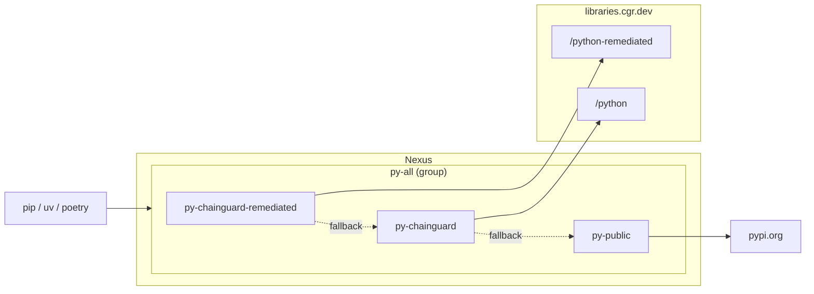

# Chainguard Libraries for Python — Sonatype Nexus

Provisions a Nexus group PyPI repository backed by the Chainguard remediated
index, the Chainguard standard index, and public PyPI as fallback (in that
order), following the Nexus setup recommended in the
[Chainguard Libraries for Python management docs](https://edu.chainguard.dev/chainguard/libraries/python/management/#sonatype-nexus-repository).

## Architecture



> [!NOTE]
> The remediated proxy does not currently serve wheel downloads through
> Nexus — Apache HttpClient inside Nexus decodes `%2B` to `+` when
> following the upstream's 302 to a Cloudflare R2 pre-signed URL, breaking
> the AWS SigV4 signature. The standard Chainguard proxy and the public
> PyPI fallback work end-to-end. See the inline comment on the remediated
> proxy in `main.tf` for the full trace.

## Usage

1. Generate a Chainguard pull token (replace `<org>` with your organization):

   ```sh
   eval $(chainctl auth pull-token --output env --repository=python --parent=<org>)
   ```

   This exports `CHAINGUARD_PYTHON_IDENTITY_ID` and `CHAINGUARD_PYTHON_TOKEN`.

2. Point the Nexus provider at your instance:

   ```sh
   export NEXUS_URL=https://nexus.example.com
   export NEXUS_USERNAME=<admin-user>
   export NEXUS_PASSWORD=<admin-password>
   ```

   The provider reads `NEXUS_URL`, `NEXUS_USERNAME`, and `NEXUS_PASSWORD`
   from the environment.

3. Write `terraform.tfvars`:

   ```sh
   cat > terraform.tfvars <<EOF
   name                = "your-name"
   chainguard_username = "${CHAINGUARD_PYTHON_IDENTITY_ID}"
   chainguard_password = "${CHAINGUARD_PYTHON_TOKEN}"
   EOF
   ```

4. `terraform init && terraform apply`.

Point pip at `${NEXUS_URL}/repository/your-name-py-all/simple/`.

## Example

### curl

Smoke-test the group:

```sh
curl -u "$NEXUS_USERNAME:$NEXUS_PASSWORD" -L "$NEXUS_URL/repository/your-name-py-all/simple/requests/" | head -5
```

### pip

```sh
pip install --index-url "http://$NEXUS_USERNAME:$NEXUS_PASSWORD@<nexus-host>:8081/repository/your-name-py-all/simple/" requests
```

### uv

```sh
uv pip install --index-url "http://$NEXUS_USERNAME:$NEXUS_PASSWORD@<nexus-host>:8081/repository/your-name-py-all/simple/" requests
```

### Poetry

```sh
poetry source add cgr "http://<nexus-host>:8081/repository/your-name-py-all/simple/"
poetry config http-basic.cgr "$NEXUS_USERNAME" "$NEXUS_PASSWORD"
poetry add requests
```
